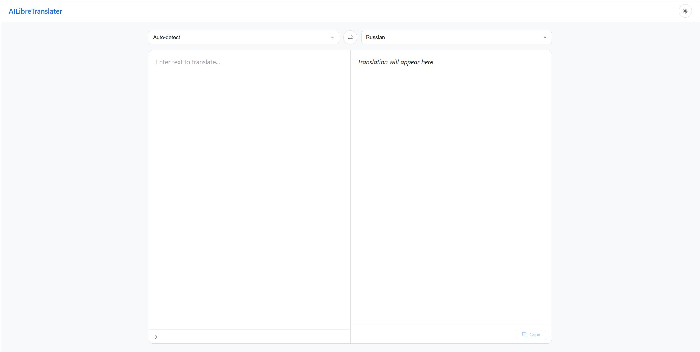
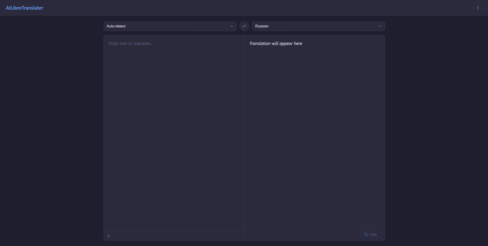

<p align="center">
  
  
  
  
</p>

# AILibreTranslater

> Self-hosted translation microservice powered by LLMs with a configurable fallback chain.

---

## 🚀 Quick start

### Windows
```batch
install.bat
start.bat
```

### Linux / macOS
```bash
chmod +x install.sh start.sh
./install.sh
./start.sh
```

Server starts at **http://0.0.0.0:5555**.

## 📦 Usage

```bash
curl -X POST http://localhost:5555/translate \
  -H "Content-Type: application/json" \
  -d '{"q": "Hello world", "source": "auto", "target": "ru"}'
```

## 🧱 Architecture

| File | Role |
|---|---|
| `main.py` | FastAPI app, routes, uvicorn launcher |
| `static/index.html` | Web UI — Google Translate-style translation interface |
| `translator.py` | `LLMTranslator` — fallback chain execution |
| `config.py` | Providers, chain definition, presets |
| `prompt_template.py` | Dynamic system/user prompt templates (any language pair) |
| `validator.py` | Script-based language validation (≥50% target script) |
| `cache_manager.py` | SHA256 JSON cache in `cache/` directory |

## ⚙️ Configuration

Set via `.env` or environment variables:

| Variable | Default | Description |
|---|---|---|
| `LOCALLLM_API_KEY` | `sk-LocalHost` | API key for local LLM |
| `LOCALLLM_BASE_URL` | `http://192.168.0.124:8080/v1` | OpenAI-compatible endpoint |
| `LOCALLLM_MODEL` | `QwenCoder` | Model name |
| `DEEPSEEK_API_KEY` | — | DeepSeek API key |
| `DEEPSEEK_BASE_URL` | `https://api.deepseek.com/v1` | DeepSeek endpoint |
| `DEEPSEEK_MODEL` | `deepseek-chat` | DeepSeek model |
| `LIBRETRANSLATE_URL` | `https://libretranslate.com/translate` | LibreTranslate endpoint |
| `LOG_TRANSLATION_CONTENT` | `false` | Log translated text |

Provider selection: `python main.py --provider localllm` or `TRANSLATOR_PROVIDER=localllm`.

Preset selection: `python main.py --preset deepseek`. Interactive choice on startup if none given.

## 🔗 Fallback chain

Defined in `config.py` as `TRANSLATION_CHAIN`. Each step is tried in order:

- ✅ **Success** → result cached and returned
- ❌ **Failure** → next step runs

**Two LLM modes:**

- 💬 **chat** (default): `chat.completions.create()` with system/user/assistant messages
- ⚡ **completions**: `completions.create()` with raw `<|channel|>`-token prompt (no prefill)

**Non-LLM fallbacks:** `google` (free API), `libretranslate`.

## 🖥 Web UI

Browser-based translation interface (Google Translate style) at the root URL.

- `http://localhost:5555/` — two-panel UI with source/target language selectors, auto-translate with 2.5s debounce, swap button, copy to clipboard
- Supports all 35 languages from the validation list (auto-detect for source)
- 🌞 Light theme and 🌙 dark theme
- Served from `static/index.html`

| Light theme | Dark theme |
|---|---|
|  |  |

## 🌐 API Routes

| Method | Path | Description |
|---|---|---|
| 🟢 `GET` | `/` | Web UI (translation interface) |
| 🟢 `POST` | `/translate` | Translate text (`q`, `source`, `target`) |
| 🟢 `GET` | `/health` | Health check |
| 🔵 `GET` | `/cache` | List cache entries |
| 🔴 `DELETE` | `/cache/{hash_key}` | Delete single cache entry |
| 🟡 `POST` | `/cache/{hash_key}/invalidate` | Invalidate cache entry |

## ✅ Validation

Output is validated per language script. At least **50%** of alphabetic characters must match the target script:

- 🇷🇺 Cyrillic — ru, uk, be, bg, sr
- 🇨🇳 CJK — zh, ja, ko
- 🇸🇦 Arabic — ar
- 🇮🇱 Hebrew — he
- 🇹🇭 Thai — th
- 🇬🇷 Greek — el
- 🇮🇳 Devanagari — hi
- 🔤 Latin — en, es, fr, de, it, pt, nl, pl, tr, vi, cs, sv, da, fi, id, ms, no, ro, hu

Falls through (always valid) for unsupported languages.

## 📦 Dependencies

```
fastapi    uvicorn    openai
pydantic   httpx      python-dotenv
```

---

<p align="center">
  
  
  
  
</p>

# AILibreTranslater

> Самописный микросервис перевода на базе LLM с настраиваемой цепочкой fallback.

---

## 🚀 Быстрый старт

### Windows
```batch
install.bat
start.bat
```

### Linux / macOS
```bash
chmod +x install.sh start.sh
./install.sh
./start.sh
```

Сервер запускается на **http://0.0.0.0:5555**.

## 📦 Использование

```bash
curl -X POST http://localhost:5555/translate \
  -H "Content-Type: application/json" \
  -d '{"q": "Hello world", "source": "auto", "target": "ru"}'
```

## 🧱 Архитектура

| Файл | Роль |
|---|---|
| `main.py` | FastAPI приложение, роуты, запуск uvicorn |
| `static/index.html` | Web UI — интерфейс перевода в стиле Google Translate |
| `translator.py` | `LLMTranslator` — исполнение цепочки fallback |
| `config.py` | Провайдеры, цепочка перевода, пресеты |
| `prompt_template.py` | Динамический системный/пользовательский промпт (любая языковая пара) |
| `validator.py` | Валидация языка по скрипту (≥50% целевого алфавита) |
| `cache_manager.py` | SHA256 JSON-кэш в `cache/` |

## ⚙️ Конфигурация

Задаётся через `.env` или переменные окружения:

| Переменная | По умолчанию | Описание |
|---|---|---|
| `LOCALLLM_API_KEY` | `sk-LocalHost` | API-ключ для локальной LLM |
| `LOCALLLM_BASE_URL` | `http://192.168.0.124:8080/v1` | OpenAI-совместимый эндпоинт |
| `LOCALLLM_MODEL` | `QwenCoder` | Название модели |
| `DEEPSEEK_API_KEY` | — | API-ключ DeepSeek |
| `DEEPSEEK_BASE_URL` | `https://api.deepseek.com/v1` | Эндпоинт DeepSeek |
| `DEEPSEEK_MODEL` | `deepseek-chat` | Модель DeepSeek |
| `LIBRETRANSLATE_URL` | `https://libretranslate.com/translate` | Эндпоинт LibreTranslate |
| `LOG_TRANSLATION_CONTENT` | `false` | Логировать текст перевода |

Выбор провайдера: `python main.py --provider localllm` или `TRANSLATOR_PROVIDER=localllm`.

Выбор пресета: `python main.py --preset deepseek`. Интерактивный выбор при запуске, если пресет не указан.

## 🔗 Цепочка fallback

Определяется в `config.py` как `TRANSLATION_CHAIN`. Шаги выполняются по порядку:

- ✅ **Успех** → результат кэшируется и возвращается
- ❌ **Неудача** → выполняется следующий шаг

**Два режима LLM:**

- 💬 **chat** (по умолчанию): `chat.completions.create()` с системным/пользовательским сообщением и префиллом
- ⚡ **completions**: `completions.create()` с сырым промптом и токенами `<|channel|>` (без префилла)

**Не-LLM fallback:** `google` (бесплатный API), `libretranslate`.

## 🖥 Web UI

Интерфейс перевода в браузере (в стиле Google Translate) по корневому URL.

- `http://localhost:5555/` — двухпанельный интерфейс с выбором исходного/целевого языка, авто-перевод с задержкой 2.5с, кнопка смены языков, копирование в буфер
- Поддерживает все 35 языков из списка валидации (авто-определение для исходного)
- 🌞 Светлая тема и 🌙 тёмная тема
- Файлы в `static/index.html`

| Светлая тема | Тёмная тема |
|---|---|
|  |  |

## 🌐 API Routes

| Метод | Путь | Описание |
|---|---|---|
| 🟢 `GET` | `/` | Web UI (интерфейс перевода) |
| 🟢 `POST` | `/translate` | Перевод текста (`q`, `source`, `target`) |
| 🟢 `GET` | `/health` | Проверка работоспособности |
| 🔵 `GET` | `/cache` | Список записей кэша |
| 🔴 `DELETE` | `/cache/{hash_key}` | Удалить одну запись кэша |
| 🟡 `POST` | `/cache/{hash_key}/invalidate` | Инвалидировать запись кэша |

## ✅ Валидация

Результат проверяется по алфавиту целевого языка. Не менее **50%** буквенных символов должны относиться к целевому скрипту:

- 🇷🇺 Кириллица — ru, uk, be, bg, sr
- 🇨🇳 CJK — zh, ja, ko
- 🇸🇦 Арабский — ar
- 🇮🇱 Иврит — he
- 🇹🇭 Тайский — th
- 🇬🇷 Греческий — el
- 🇮🇳 Деванагари — hi
- 🔤 Латиница — en, es, fr, de, it, pt, nl, pl, tr, vi, cs, sv, da, fi, id, ms, no, ro, hu

Для неподдерживаемых языков валидация пропускается.

## 📦 Зависимости

```
fastapi    uvicorn    openai
pydantic   httpx      python-dotenv
```
