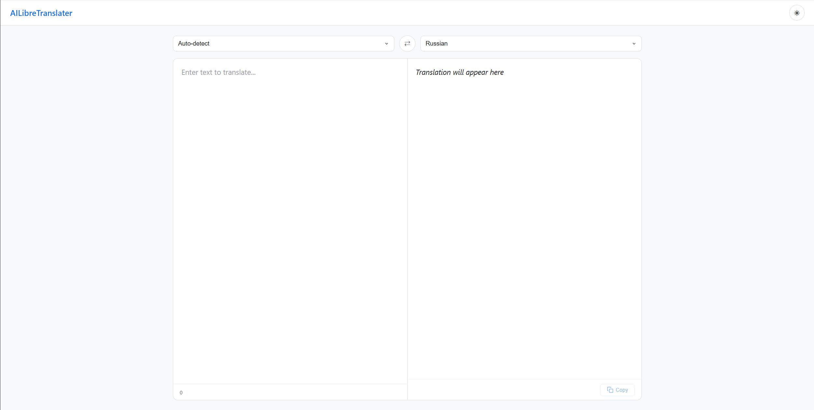
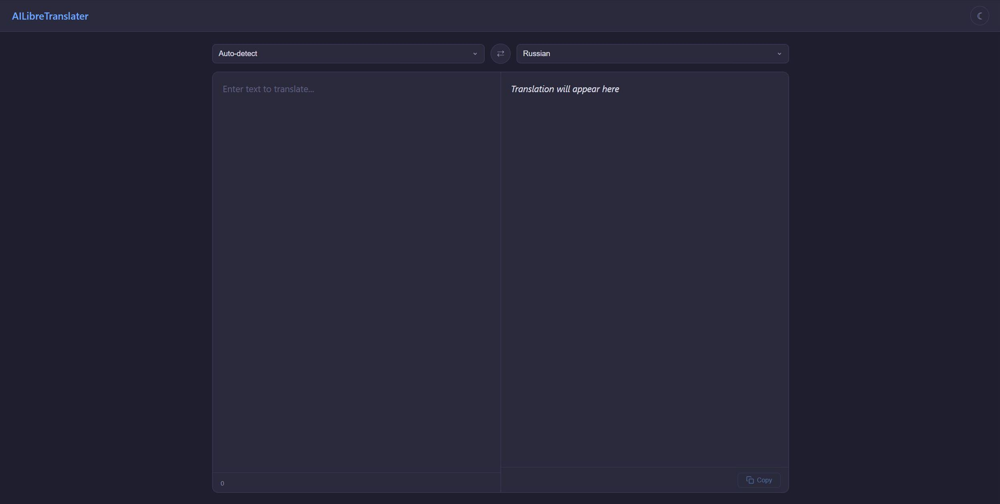
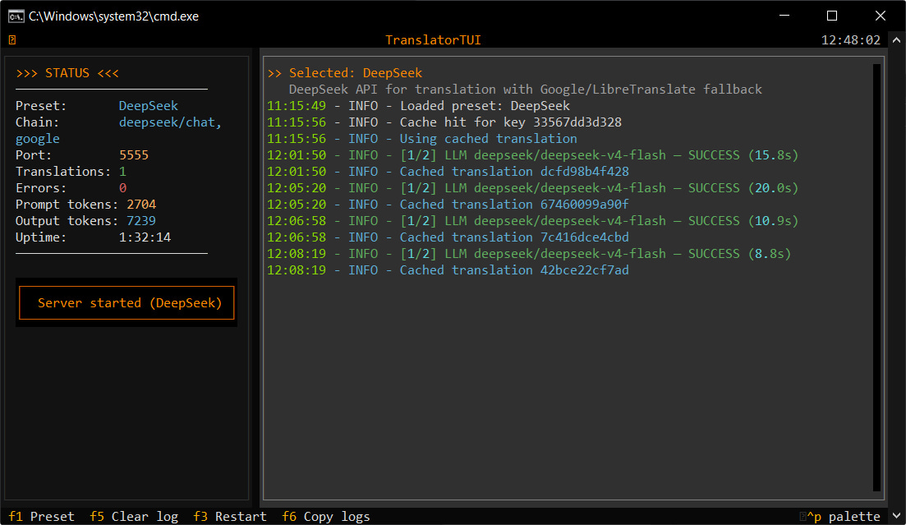

<p align="center">
  
  
  
  
</p>

# AILibreTranslater

> Self-hosted translation microservice powered by LLMs with a configurable fallback chain.

---

## 🚀 Quick start

### Windows
```batch
install.bat
start.bat
```

### Linux / macOS
```bash
chmod +x install.sh start.sh
./install.sh
./start.sh
```

Server starts at **http://0.0.0.0:5555**.

## 💻 CLI (direct start)

```bash
# Server using config.json in project root (or config.json.example fallback)
venv/bin/python main.py

# Server with a specific config file
venv/bin/python main.py --config configs/deepseek.json

# Choose a provider
venv/bin/python main.py --provider localllm

# Or set via environment variable
TRANSLATOR_PROVIDER=localllm venv/bin/python main.py

# TUI (Textual terminal interface)
venv/bin/python tui.py
venv/bin/python tui.py --config configs/deepseek.json
```

On Windows with venv: `venv\Scripts\python main.py`.

## 📦 Usage

```bash
curl -X POST http://localhost:5555/translate \
  -H "Content-Type: application/json" \
  -d '{"q": "Hello world", "source": "auto", "target": "ru"}'
```

## 🧱 Architecture

| File | Role |
|---|---|
| `main.py` | FastAPI app, routes, uvicorn launcher |
| `static/index.html` | Web UI — Google Translate-style translation interface |
| `tui.py` | TUI — Textual-based terminal translation interface |
| `translator.py` | `LLMTranslator` — fallback chain execution |
| `config.py` | Config loader (.env keys + config.json parsing) |
| `prompt_template.py` | Dynamic system/user prompt templates (any language pair) |
| `validator.py` | Script-based language validation (≥50% target script) |
| `cache_manager.py` | SHA256 JSON cache in `cache/` directory |

## ⚙️ Configuration

### .env — API keys only

`.env` (gitignored, copy from `.env.example`) holds **only API keys**. Variable names can be arbitrary — each name is referenced by the `api_key` field in `config.json`.

```
LOCALLLM_API_KEY=sk-LocalHost
DEEPSEEK_API_KEY=sk-your-deepseek-key-here
LIBRETRANSLATE_API_KEY=
```

### config.json — launch configuration

`config.json` (gitignored, copy from `config.json.example`) defines providers, chain, and runtime settings.

**Key resolution for `api_key`:**
- If the value is a non-empty string that exists as an env var → the env var's value is used.
- If the env var is not set → the value is kept as a literal (useful for local servers, e.g. `"sk-LocalHost"`).

**Structure:**
```json
{
  "providers": {
    "deepseek": {
      "api_key": "DEEPSEEK_API_KEY",
      "base_url": "https://api.deepseek.com/v1",
      "model": "deepseek-v4-flash",
      "prefill": "",
      "api_type": "deepseek",
      "reasoning_effort": null
    }
  },
  "default_provider": "deepseek",
  "translation_chain": [
    {"type": "llm", "provider": "deepseek", "max_tokens": null}
  ],
  "libretranslate_url": "https://libretranslate.com/translate",
  "libretranslate_api_key": "",
  "log_translation_content": false
}
```

**Config file resolution priority:**
1. `TRANSLATOR_CONFIG` env var (absolute or relative to project root)
2. `config.json` in project root
3. `config.json.example` fallback (with warning)
4. Empty config (with error)

Ready-made minimal templates are in `configs/` (deepseek, localllm, deepseek+fallback). Copy the one you need to `config.json`.

### Reasoning effort

Provider default from `config.json` (`reasoning_effort` field). Runtime override via TUI `F2` cycles `low` → `high` → `max` → `off`. `off` (None) disables thinking.

Priority: `reasoning_state.json` > `config.json` (or `--config`) > `config.json.example` > empty.

## 🔗 Fallback chain

Defined in `config.json` as `translation_chain`. Each step is tried in order:

- ✅ **Success** → result cached and returned
- ❌ **Failure** → next step runs

**Two LLM modes:**

- 💬 **chat** (default): `chat.completions.create()` with system/user/assistant messages
- ⚡ **completions**: `completions.create()` with raw `<|channel|>`-token prompt (no prefill)

**API types per provider** (`api_type` in `providers`):

- 🔵 `openai` (default): OpenAI-compatible `chat.completions`, reasoning effort sent as `extra_body["reasoning_effort"]`
- 🔴 `deepseek`: native DeepSeek API, reasoning effort sent as top-level `"thinking": {"reasoning_effort": ...}`

**Non-LLM fallbacks:** `google` (free API), `libretranslate`.

## 🖥 Web UI

Browser-based translation interface (Google Translate style) at the root URL.

- `http://localhost:5555/` — two-panel UI with source/target language selectors, auto-translate with 2.5s debounce, swap button, copy to clipboard
- Supports all 35 languages from the validation list (auto-detect for source)
- 🌞 Light theme and 🌙 dark theme
- Served from `static/index.html`

| Light theme | Dark theme |
|---|---|
|  |  |

## 🖥 TUI

Terminal-based translation interface (Textual) — a full-featured TUI for quick translations without leaving the terminal.

- `python tui.py` — launches the TUI with a translation panel, log viewer, and status bar
- Two-panel layout: source input (top) and translation output (bottom)
- Live server log stream in a dedicated panel
- Keyboard-driven workflow:
  - `Tab` — cycle focus between panels
  - `Ctrl+T` — swap source/target languages
  - `Ctrl+C` — copy translation result
  - `Ctrl+Q` — quit
- TUI automatically starts the FastAPI server as a subprocess if not already running
- Serves as a standalone alternative to the Web UI — useful for server administration or headless environments

| TUI main screen |
|---|
|  |

## 🌐 API Routes

| Method | Path | Description |
|---|---|---|
| 🟢 `GET` | `/` | Web UI (translation interface) |
| 🟢 `POST` | `/translate` | Translate text (`q`, `source`, `target`) |
| 🟢 `GET` | `/health` | Health check |
| 🔵 `GET` | `/cache` | List cache entries |
| 🔴 `DELETE` | `/cache/{hash_key}` | Delete single cache entry |
| 🟡 `POST` | `/cache/{hash_key}/invalidate` | Invalidate cache entry |

## ✅ Validation

Output is validated per language script. At least **50%** of alphabetic characters must match the target script:

- 🇷🇺 Cyrillic — ru, uk, be, bg, sr
- 🇨🇳 CJK — zh, ja, ko
- 🇸🇦 Arabic — ar
- 🇮🇱 Hebrew — he
- 🇹🇭 Thai — th
- 🇬🇷 Greek — el
- 🇮🇳 Devanagari — hi
- 🔤 Latin — en, es, fr, de, it, pt, nl, pl, tr, vi, cs, sv, da, fi, id, ms, no, ro, hu

Falls through (always valid) for unsupported languages.

## 📦 Dependencies

```
fastapi    uvicorn    openai
pydantic   httpx      python-dotenv
```

---

<p align="center">
  
  
  
  
</p>

# AILibreTranslater

> Самописный микросервис перевода на базе LLM с настраиваемой цепочкой fallback.

---

## 🚀 Быстрый старт

### Windows
```batch
install.bat
start.bat
```

### Linux / macOS
```bash
chmod +x install.sh start.sh
./install.sh
./start.sh
```

Сервер запускается на **http://0.0.0.0:5555**.

## 💻 CLI (прямой запуск)

```bash
# Сервер с config.json в корне проекта (или fallback на config.json.example)
venv/bin/python main.py

# Сервер с конкретным файлом конфигурации
venv/bin/python main.py --config configs/deepseek.json

# Выбор провайдера
venv/bin/python main.py --provider localllm

# Или через переменную окружения
TRANSLATOR_PROVIDER=localllm venv/bin/python main.py

# TUI (терминальный интерфейс на Textual)
venv/bin/python tui.py
venv/bin/python tui.py --config configs/deepseek.json
```

В Windows с venv: `venv\Scripts\python main.py`.

## 📦 Использование

```bash
curl -X POST http://localhost:5555/translate \
  -H "Content-Type: application/json" \
  -d '{"q": "Hello world", "source": "auto", "target": "ru"}'
```

## 🧱 Архитектура

| Файл | Роль |
|---|---|
| `main.py` | FastAPI приложение, роуты, запуск uvicorn |
| `static/index.html` | Web UI — интерфейс перевода в стиле Google Translate |
| `tui.py` | TUI — терминальный интерфейс перевода на Textual |
| `translator.py` | `LLMTranslator` — исполнение цепочки fallback |
| `config.py` | Загрузчик конфигурации (.env ключи + parsing config.json) |
| `prompt_template.py` | Динамический системный/пользовательский промпт (любая языковая пара) |
| `validator.py` | Валидация языка по скрипту (≥50% целевого алфавита) |
| `cache_manager.py` | SHA256 JSON-кэш в `cache/` |

## ⚙️ Конфигурация

### .env — только API-ключи

`.env` (gitignored, копируется из `.env.example`) содержит **только API-ключи**. Имя переменной может быть любым — на него ссылается поле `api_key` в `config.json`.

```
LOCALLLM_API_KEY=sk-LocalHost
DEEPSEEK_API_KEY=sk-your-deepseek-key-here
LIBRETRANSLATE_API_KEY=
```

### config.json — конфигурация запуска

`config.json` (gitignored, копируется из `config.json.example`) определяет провайдеров, цепочку и настройки runtime.

**Разрешение `api_key`:**
- Если значение — непустая строка и существует как переменная окружения → подставляется значение из env.
- Если переменной нет → значение остаётся литералом (для локальных серверов, например `"sk-LocalHost"`).

**Структура:**
```json
{
  "providers": {
    "deepseek": {
      "api_key": "DEEPSEEK_API_KEY",
      "base_url": "https://api.deepseek.com/v1",
      "model": "deepseek-v4-flash",
      "prefill": "",
      "api_type": "deepseek",
      "reasoning_effort": null
    }
  },
  "default_provider": "deepseek",
  "translation_chain": [
    {"type": "llm", "provider": "deepseek", "max_tokens": null}
  ],
  "libretranslate_url": "https://libretranslate.com/translate",
  "libretranslate_api_key": "",
  "log_translation_content": false
}
```

**Приоритет файла конфигурации:**
1. Переменная окружения `TRANSLATOR_CONFIG` (абсолютный или относительный путь)
2. `config.json` в корне проекта
3. `config.json.example` (с предупреждением)
4. Пустая конфигурация (с ошибкой)

Готовые минимальные шаблоны лежат в `configs/` (deepseek, localllm, deepseek+fallback). Скопируйте нужный в `config.json`.

### Режим мышления (reasoning effort)

Значение по умолчанию из `config.json` (`reasoning_effort`). Переключение в TUI по `F2`: `low` → `high` → `max` → `off`. `off` (None) отключает мышление.

Приоритет: `reasoning_state.json` > `config.json` (или `--config`) > `config.json.example` > пусто.

## 🔗 Цепочка fallback

Определяется в `config.json` как `translation_chain`. Шаги выполняются по порядку:

- ✅ **Успех** → результат кэшируется и возвращается
- ❌ **Неудача** → выполняется следующий шаг

**Два режима LLM:**

- 💬 **chat** (по умолчанию): `chat.completions.create()` с системным/пользовательским сообщением и префиллом
- ⚡ **completions**: `completions.create()` с сырым промптом и токенами `<|channel|>` (без префилла)

**Типы API провайдеров** (`api_type` в `providers`):

- 🔵 `openai` (по умолчанию): OpenAI-совместимые `chat.completions`, режим мышления уходит как `extra_body["reasoning_effort"]`
- 🔴 `deepseek`: нативный DeepSeek API, режим мышления уходит как top-level `"thinking": {"reasoning_effort": ...}`

**Не-LLM fallback:** `google` (бесплатный API), `libretranslate`.

## 🖥 Web UI

Интерфейс перевода в браузере (в стиле Google Translate) по корневому URL.

- `http://localhost:5555/` — двухпанельный интерфейс с выбором исходного/целевого языка, авто-перевод с задержкой 2.5с, кнопка смены языков, копирование в буфер
- Поддерживает все 35 языков из списка валидации (авто-определение для исходного)
- 🌞 Светлая тема и 🌙 тёмная тема
- Файлы в `static/index.html`

| Светлая тема | Тёмная тема |
|---|---|
|  |  |

## 🖥 TUI

Терминальный интерфейс перевода на базе Textual — полнофункциональный TUI для быстрых переводов без выхода в браузер.

- `python tui.py` — запускает TUI с панелью перевода, лог-вьювером и статус-баром
- Двухпанельная раскладка: ввод исходного текста (сверху) и результат перевода (снизу)
- Прямая трансляция логов сервера в отдельной панели
- Управление с клавиатуры:
  - `Tab` — циклическое переключение фокуса между панелями
  - `Ctrl+T` — смена языков местами
  - `Ctrl+C` — копирование результата перевода
  - `Ctrl+Q` — выход
- TUI автоматически запускает FastAPI сервер как подпроцесс
- Полноценная альтернатива Web UI — удобно для администрирования сервера или окружений без браузера

| Главный экран TUI |
|---|
|  |

## 🌐 API Routes

| Метод | Путь | Описание |
|---|---|---|
| 🟢 `GET` | `/` | Web UI (интерфейс перевода) |
| 🟢 `POST` | `/translate` | Перевод текста (`q`, `source`, `target`) |
| 🟢 `GET` | `/health` | Проверка работоспособности |
| 🔵 `GET` | `/cache` | Список записей кэша |
| 🔴 `DELETE` | `/cache/{hash_key}` | Удалить одну запись кэша |
| 🟡 `POST` | `/cache/{hash_key}/invalidate` | Инвалидировать запись кэша |

## ✅ Валидация

Результат проверяется по алфавиту целевого языка. Не менее **50%** буквенных символов должны относиться к целевому скрипту:

- 🇷🇺 Кириллица — ru, uk, be, bg, sr
- 🇨🇳 CJK — zh, ja, ko
- 🇸🇦 Арабский — ar
- 🇮🇱 Иврит — he
- 🇹🇭 Тайский — th
- 🇬🇷 Греческий — el
- 🇮🇳 Деванагари — hi
- 🔤 Латиница — en, es, fr, de, it, pt, nl, pl, tr, vi, cs, sv, da, fi, id, ms, no, ro, hu

Для неподдерживаемых языков валидация пропускается.

## 📦 Зависимости

```
fastapi    uvicorn    openai
pydantic   httpx      python-dotenv
```
